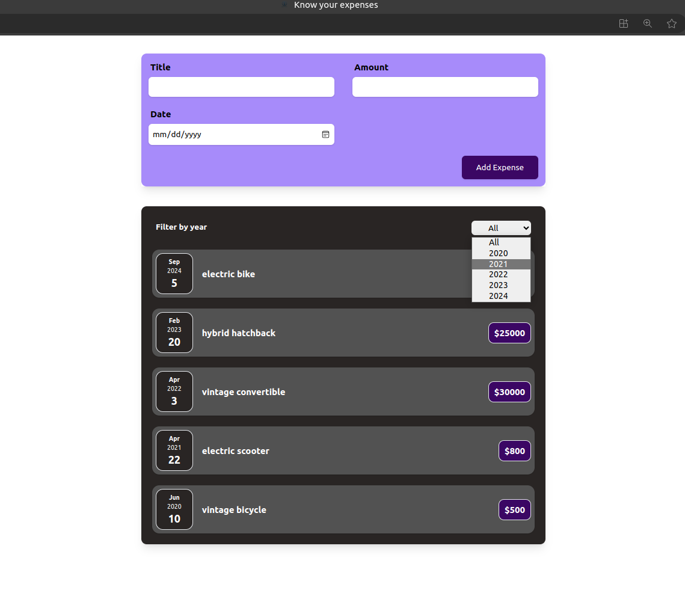

# Expense Tracker App

The Expense Tracker App is a simple React application designed to help users track their expenses. It enables users to add new expenses with details such as title, amount, and date, and view a list of expenses filtered by year. The app utilizes React components to manage the user interface and state, providing an intuitive and efficient user experience.

## Features

- **Add Expenses**: Users can add new expenses by providing a title, amount, and date.
- **Filter Expenses**: Expenses can be filtered by year, allowing users to view expenses from specific years.
- **Clear Form**: After submitting an expense, the form fields are automatically cleared for convenience.
- **Responsive Design**: The app is designed to be responsive and work seamlessly across different screen sizes.

## Technologies Used

- **React**: The app is built using React, a popular JavaScript library for building user interfaces.
- **Tailwind-CSS**: Custom styling is applied using CSS to enhance the visual appeal and user experience.
- **UUID**: The UUID library is used to generate unique identifiers for each expense item.

## Usage

1. Clone the repository to your local machine.
2. Navigate to the project directory.
3. Install dependencies using `npm install`.
4. Run the development server using `npm start`.
5. Access the Expense Tracker App in your web browser at `http://localhost:3000`.

**Note:**

1. The app comes with demo data pre-loaded. To remove demo data, open the `App.js` file and set the `demoData` array to an empty array.
2. This Expense Tracker App does not have a backend and does not store data persistently, either locally or on a server. Therefore, any data entered into the app will be lost upon refreshing the page or navigating away from it. If you want to preserve your expense data, you may need to implement backend storage solutions or utilize local storage mechanisms.

## Screenshot

## Contributing

Contributions are welcome! If you'd like to contribute to the project, feel free to submit a pull request or open an issue with any suggestions or bug reports.

## Acknowledgements

Special thanks to [OpenAI](https://openai.com) for providing guidance and support during the development of this project.

## Contact

For any inquiries or feedback, please contact Beka Birhanu at [beka.b.atomsa@gmail.com](mailto:beka.b.atomsa@gmail.com).

## Know your expenses with the Expense Tracker App! 📊💰
